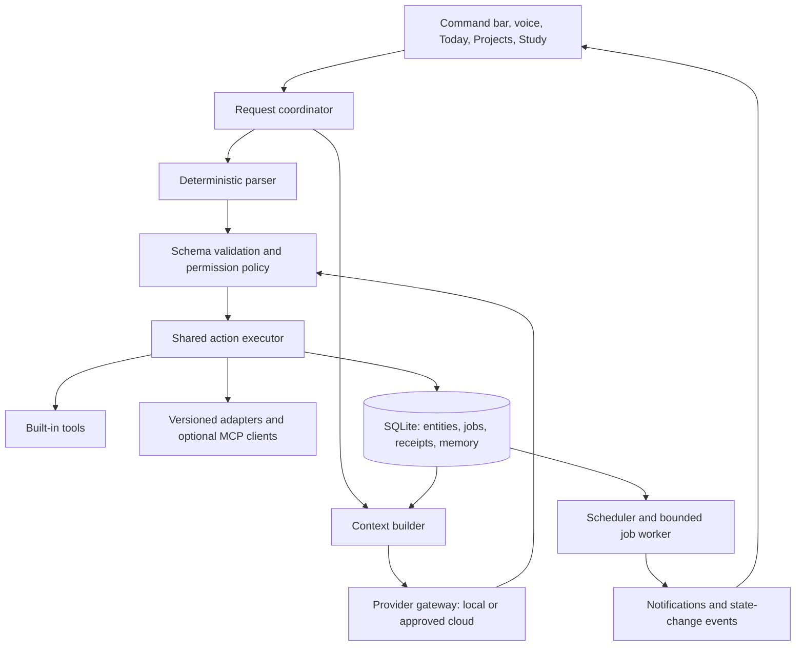

# VEGA: a personal workspace that survives model changes

Prepared 2026-09-22. This is the proposed next architecture, not a claim that these features exist. It extends the original roadmap; M1, AI Radar, and the M2a voice work remain the starting point. Research and source links: [VEGA_TECH_RESEARCH.md](VEGA_TECH_RESEARCH.md). Next bounded assignment: [QODER_VEGA_FOUNDATION_PROMPT.md](QODER_VEGA_FOUNDATION_PROMPT.md).

## 1. Product direction

VEGA should be the place that remembers what you are doing, helps choose the next useful action, opens the right workspace, performs supported actions, and records what happened. A model supplies reasoning when needed. Your projects, permissions, deadlines, preferences, and history belong to VEGA and must survive a model swap.

The core interaction is: **capture → choose → act → verify → remember**.

The first compelling demonstration should be: “I have 40 minutes. Help me move my project forward.” VEGA reads the chosen project's real next action and deadline, proposes one achievable outcome, opens its registered folder/IDE, starts a focus block, and saves an end-of-session note. It does not require a fresh explanation of the project or an unlimited cloud subscription.

## 2. What the current repository tells us

Inspected the current files rather than assuming old handoffs describe the present state:

- M1 already has deterministic parsing, tools, SQLite records, action receipts, and a scheduler. Preserve those working paths.
- M2a is present in `backend/voice_service.py` and its handoff. Live human wake-word accuracy is still a separate measurement; do not assign the whole M2a implementation again.
- `backend/main.py` still contains separate Ollama/Gemini tool lists and execution branches. The model paths expose app opening, website opening, and task listing, while the productivity executor supports more actions. A stronger model alone cannot bridge this missing integration.
- Gemini's model name is fixed in code; Ollama defaults to `llama3`. Neither is a measured choice for this laptop. Provider selection and history handling are embedded in the endpoint.
- Model requests take the last 20 messages, which is a message-count bound, not a token budget or long-term memory strategy.
- The dashboard favors chat, telemetry, and feeds. It gives tasks insufficient layout space and has no central view of subjects, projects, and their next actions.
- The Productivity Hub refreshes state every five seconds and ticks every second even with no running countdown. `SystemMonitor` subscribes to frequent statistics. The 3D and gesture modules are imported from App. These are candidates for measurement and selective loading; they are not proof of the observed CPU usage.
- The screenshot reports whole-machine CPU/memory usage. It cannot establish how much VEGA itself uses.

Hardware: `nvidia-smi` verified an RTX 3050 A Laptop GPU with 4094 MiB VRAM in this pass. Earlier project records report Ryzen 7 7435HS and 24 GiB RAM; this pass could not refresh CPU/RAM via Windows CIM because access was denied. Confirm those before choosing memory budgets.

## 3. The cost and capability contract

There is no credible design that guarantees unlimited frontier-model reasoning, tiny resource use, and permanently free cloud access simultaneously. Design for continuity of useful work:

| Lane | Work | When it runs |
| --- | --- | --- |
| Deterministic | Timers, tasks, deadlines, project lookup, launching registered apps, retrieving saved facts | Immediately; no LLM tokens |
| Small local model | Paraphrase-to-intent, short explanations, extracting structured data, drafting session notes | On demand, with bounded context |
| Stronger optional cloud model | Difficult reasoning, larger code explanations, richer tutoring | Only with an allowed provider, sufficient quota, and permitted data |
| Durable job | Long research/import/review | Checkpointed work that can pause and resume |

Cloud exhaustion should say “Advanced reasoning is unavailable; your tasks and local workspace still work.” A hard problem can be saved for later. Do not silently claim a small local model delivers the same quality as a frontier model. Do not automatically move private content to another provider or switch to a paid model.

Coding-agent access in Qoder/Antigravity and VEGA's own inference API access are separate capabilities. Do not assume an IDE subscription grants an API key or unlimited embedded inference.

## 4. Architecture: one application with replaceable boundaries

Keep Electron/React + FastAPI + SQLite. Use modules in one backend process plus bounded workers. Do not add Redis, a distributed message broker, multiple agent servers, or a new desktop framework just to make the architecture look sophisticated.



### Stable interfaces

1. **Provider gateway.** A normalized request/result interface for text, tool proposals, streaming, usage, cancellation, and typed errors. Capabilities describe actual model/runtime support: tools, schemas, vision, context, local/cloud, and data policy. Never infer capabilities solely from a model's name.
2. **Tool registry.** One schema and handler binding for each capability, shared by deterministic commands and all providers. Include version, required scope, side effects, timeout, input/output bounds, and retry semantics. Never expose a general shell as a fallback for an unknown command.
3. **Context builder.** Assemble a versioned VEGA identity, user preferences, the selected workspace, relevant records, a short recent conversation window, and a small set of relevant tool definitions. Measure its token size.
4. **Action executor.** Preserve the existing validation/idempotency/receipt behavior. Persist action IDs before replayable steps. Model text proposes actions; executor results establish whether they happened. Partial or malformed streamed output never executes.
5. **Integration adapters.** Built-in tools remain simple Python modules. Add MCP as one external integration mechanism after the registry exists. Protocol support does not itself grant permission or make a third-party server trustworthy. Negotiate/pin supported versions and test the adapter contract. MCP standardizes tool/resource connections [R4].
6. **Job manager.** Persist long operations with `queued`, `running`, `waiting_user`, `waiting_provider`, `succeeded`, `failed`, and `cancelled` states. Save checkpoints and results before advancing. A restart reconciles unfinished work; it must not blindly replay side effects.

Illustrative tool manifest (a design contract, not an implementation file):

```json
{
  "id": "projects.resume",
  "version": "1.0",
  "input_schema": {"type": "object", "properties": {"project_id": {"type": "string"}}, "required": ["project_id"], "additionalProperties": false},
  "permissions": ["projects.read", "apps.launch_registered"],
  "side_effects": ["opens_registered_app"],
  "timeout_ms": 5000,
  "retry": "reconcile_before_retry"
}
```

Adding a provider should require an adapter/configuration and contract tests, not rewriting memory, UI components, or tools. Adding a capability should require a registry entry, implementation, and scoped permission, not changes in every provider branch. This reduces future integration work; it does not promise every future service will be automatically compatible.

## 5. Persistent context that remains yours

Use SQLite as the authority and Markdown/JSON exports for portability:

- `workspaces`: personal projects and academic subjects, paths, objectives, next action, status, and relevant links.
- Existing tasks/reminders gain optional workspace relationships through additive migrations.
- `session_notes`: accomplished work, blocker, proposed next step, timestamp, source evidence, and user edits.
- `memory_facts`: explicit preferences and accepted facts, with provenance, scope, revision, and optional expiry. Inferences remain distinguishable from user-confirmed facts.
- `documents` and `chunks`: selected local notes/PDFs with content hashes and page/section provenance. Start retrieval with SQLite FTS5 [R5]. Use OCR/layout extraction only for files that need it [R6].
- `jobs`, `job_steps`, and existing receipts: persistent execution state rather than a chat-only promise.

Resolve tasks and deadlines from structured records at request time. Do not let an old summary overrule a completed task or changed exam date. A model's answer is not automatically a new personal fact. Provide inspect/edit/delete/export controls and workspace-scoped retrieval. Never ingest the whole home directory or repository secrets by default.

Context packing policy: reserve room for the answer, then select relevant evidence and tools. Cache derived summaries by source hash and prompt version; invalidate them when sources change. Keep the raw authoritative records available. Splitting or summarizing a file saves context, but must preserve citations and disclose omissions. A local model still has a finite context window.

## 6. Features that would make VEGA worth using daily

| Feature | Example | Why it matters | First implementation |
| --- | --- | --- | --- |
| Resume my work | “Resume my storage-manager project.” | Avoids rebuilding context every session | Registered path, read-only Git status, last note, next step, app launch |
| Time-aware next action | “I have 25 minutes before class.” | Turns free time into one attainable outcome | Duration/deadline/priority filter, editable suggestion with explanation |
| Deadline recovery | “I missed yesterday's study block.” | Produces a revised plan with realistic capacity | Recompute future blocks; preview changes before saving |
| Evidence-based tutor | “Quiz me on chapter 3 from my notes.” | Grounds learning in the actual syllabus | Selected PDF/text, cited retrieval, answer key, saved mistakes |
| Session closure | “I'm done for today.” | Leaves tomorrow's starting point ready | Show completed actions, request missing context, save editable note |
| Project handoff pack | “Prepare this bug for Qoder.” | Makes existing coding tools more effective | Export selected issue, constraints, relevant paths, recent checks, acceptance criteria |
| Useful AI Radar | “Would this new model help my setup?” | Converts news into a relevant recommendation | Verified metadata, fit estimate, existing-model comparison, optional local evaluation |
| Named routines | “Start my DSA practice.” | Makes repeated setup one action | Open registered resources, choose due exercise, start timer, receipt |

The first flagship should be **Resume my work + session closure**. It has immediate value without demanding a giant model. Academic planning follows using the same workspaces and task infrastructure. Automatic code editing by an unrestricted overnight agent is not the initial product feature.

Proactivity should be based on explicit subscriptions: a morning briefing, an upcoming deadline, or the end of a focus session. Coalesce related alerts, respect quiet hours, and permit snooze/disable. Avoid an LLM that continuously watches the screen and invents reasons to interrupt.

## 7. Resource policy and model evaluation

Default to a compact command bar and Today view. Move telemetry into an on-demand diagnostics drawer and Radar into Research. Make the 3D scene/camera an explicitly enabled mode with lazy imports. Pause offscreen rendering and decorative animation. Electron's guidance emphasizes measuring and avoiding unnecessary work [R7]. Keep scheduler/notification delivery alive when the renderer is hidden.

Measure separate modes: core idle, wake-listening idle, visible dashboard, transcription, warm local inference, cold local inference, and document import. Count the Electron process tree, backend, and model server; the GPU may be shared with the IDE and other apps.

Starting acceptance targets below are engineering goals, not measurements or hardware guarantees:

| Measurement | Initial target |
| --- | --- |
| Core hidden, wake off, no jobs/model loaded | Mean <2% machine-normalized CPU over 10 minutes; <600 MiB process-tree working set |
| Wake listening, no transcription | Mean <5% machine-normalized CPU; record actual wake/STT model memory separately |
| Deterministic command latency | p95 <300 ms, excluding an external app's own launch time |
| Local command interpretation | p95 <5 s warm; report cold start separately |
| Hidden renderer | No 3D/camera work; no one-second visual countdown updates |
| Long job | Cancellable; survives a restart without duplicate completed actions |
| Supported core commands | 100% pass an offline golden suite; zero provider calls |

Use one active generation initially. Index/OCR jobs pause during voice or interactive model work. Load models on demand, unload when idle, and bound context/concurrency; Ollama exposes controls for these [R1]. Do not keep a reasoning model running continuously for reminders.

Benchmark quantized **Qwen3.5 2B** first, then **4B** if memory and latency permit [R2]. Include **LFM2.5 1.2B Instruct** as an efficient extraction/intent candidate, not the coding or deep-knowledge model [R3]. Runtime model-card support is not proof of reliable tools on this laptop. Keep vision disabled in the default command lane.

On a roughly 4 GiB GPU, 4B quantization is only a candidate: runtime buffers, context cache, optional vision components, and desktop GPU allocation also need memory. A 27B model is not the default fit; small active parameter counts in an MoE do not mean only those weights require storage. CPU offloading trades speed for capacity.

Evaluate at least 50 fixed cases: 20 action paraphrases, 10 ambiguous requests, 10 grounded answers, 5 unavailable-provider scenarios, 5 adversarial/malformed outputs. Report tool/argument accuracy, unnecessary actions, clarification quality, latency, RSS, VRAM, and output quality. Choose the smallest candidate passing the task, not the newest announcement. Test during ordinary IDE use as well as on an otherwise idle machine.

## 8. Desktop permissions and continuity

Before expanding PC control or loading external MCP tools, add actual session authentication to HTTP and WebSocket access. CORS/origin checks are useful but are not identity. Keep the backend on loopback, keep credentials out of renderer storage, and grant access by capability and folder/application scope.

Routine approved task/timer actions should run without repeated prompts. External writes, terminal commands, publishing, and destructive changes require the applicable scope and a concrete preview. Prefer named executable/argument templates over shell strings. Retrieved documents, web pages, and tool descriptions cannot grant permissions. For later desktop interaction, prefer Windows UI Automation semantics and verify the target/outcome; coordinate clicking is a fallback [R8].

Provider retries apply to inference, never to an already executed side effect. Record a shared request ID, normalize timeouts/429/auth failures, obey retry hints, and impose a total deadline. If a tool's outcome is unknown, reconcile before retry. Do not auto-download a new model because Radar reports it; a user-selected candidate must pass the benchmark before becoming the default.

## 9. Implementation sequence

Each milestone is independently reviewable. Finish and verify one before starting another.

| Stage | Deliverable | Acceptance gate |
| --- | --- | --- |
| P0: usable baseline | Scroll/layout correction, smoke tests, resource measurements | Tasks reachable at normal/narrow windows; CPU attributable to processes |
| P1: shared intelligence boundary | Provider adapters + common tool registry/executor + bounded context/errors | Same action works via parser and mocked provider; 429 does not break core; one receipt per request |
| P2: personal workspace | Projects/subjects, next actions, session notes, compact Today/Resume UI | Resume a real registered project after restart; no repeated context explanation |
| P3: academic loop | Deadlines, study blocks, cited document search and quizzes | One real subject works end to end; citations resolve; plan respects available time |
| P4: controlled extensions | Local API auth, permission scopes, one read-only MCP integration, named routines | Adapter can be added without editing provider branches; rejected access has no effect |
| P5: measured improvement | Model evaluation registry, optional approved cloud lane, workload scheduling | Quota failure retains work; measured model upgrade improves score without resource regression |

Permission enforcement for built-ins begins in P1; do not wait for P4 to validate model proposals. P4 expands authentication and integration boundaries before expanding external control. Prototype the P2 Resume feature immediately after P1; avoid spending weeks on a universal plugin framework without a useful workflow.

## 10. Changes and checks in this planning pass

Applied a small layout fix in `frontend/src/App.jsx` and `frontend/src/index.css`: bounded scroll containers, nonshrinking panels, an explicit chat height, keyboard-focusable scroll regions, and one outer scroll area for narrow windows.

Verified the actual AIBrain/ProductivityHub components in a temporary browser fixture using the production styles/layout. At 1366×768, the productivity column had 980 px of content in a 638 px viewport, scrolled via keyboard, and visibly showed all four existing task rows. At 640×800, the outer area scrolled and the New Task input was reachable, with no horizontal overflow measured on that container. Only read existing tasks; did not create/complete/delete any. Removed the fixture afterward. This was not a full packaged Electron test; the normal browser profile was at first-run setup, which was not modified.

Checks run: frontend 18/18 Node tests passed, lint exited 0 with warnings, production build succeeded. Existing storage/voice tests are not visual tests. Build reports a large Three.js chunk and a deprecated chunking option; optimize in a measured follow-up. No backend changes or backend test claims in this pass. No model downloads, external integrations, commits, pushes, or user database/configuration edits.
